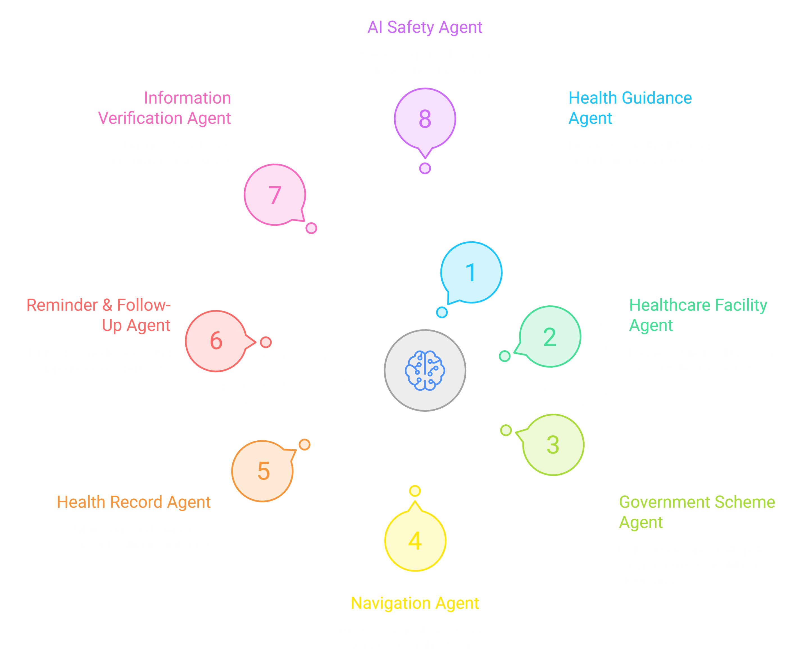
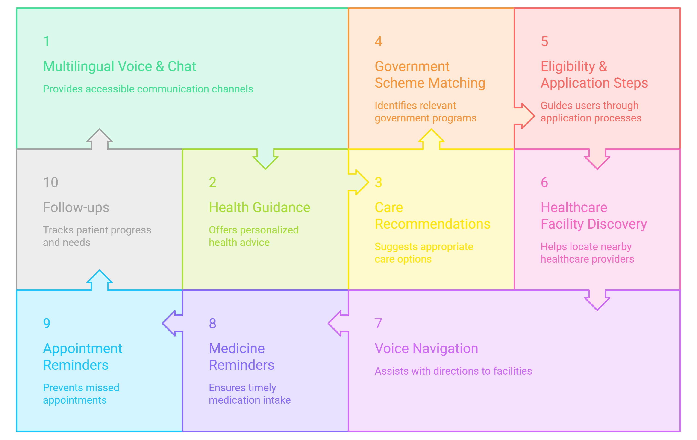

<div align="center">


<p align="center">
<b>"When healthcare becomes difficult to reach, its presence loses meaning too."</b>
━━━━━━━━━━━━━━━━━━━━━━━━━━━━━━━━━━━━━━━

<br>
<br>

</p>

<p align="center">


</p>

</div>

---

## 🌍 The Problem

Healthcare in rural India is not only about whether a doctor exists.

For many people, the real problem begins much earlier.

They may not know:

- Where should I go?
- Is this serious?
- Which hospital can actually help me?
- Can I reach it easily?
- Is there a government scheme for me?
- What documents do I need?
- What should I do after my visit?
- Can I even use this technology?

For someone living in a city, these questions may have simple answers.

For someone in a rural community, they can become a major barrier.

Language barriers, limited digital literacy, poor connectivity, scattered medical information and lack of awareness about government healthcare schemes can turn a simple healthcare decision into a difficult journey.

Most digital healthcare platforms assume that the user has:

- A smartphone
- Reliable internet
- Good digital literacy
- Knowledge of medical terminology
- Ability to type
- Awareness of available healthcare services

ASHA is built for the people who may have none of these.

---

## 💡 Our Philosophy

Traditional Healthcare Access :-

```
Problem
↓
Search Online
↓
Understand Medical Information
↓
Find Hospital
↓
Figure Out Navigation
↓
Find Government Support
↓
Manage Follow-up
```

ASHA :-

```
Speak
↓
Understand
↓
Assess
↓
Find the Right Care
↓
Navigate
↓
Access Government Support
↓
Follow Up
↓
Continue Care
```

Healthcare should not become another technology problem.

---

## 🚀 What is ASHA?

A.S.H.A. stands for Advanced Smart Healthcare Access for Rural India.
ASHA is a mobile-first, voice-first AI healthcare platform designed to make healthcare easier to understand, access and continue.

Instead of forcing users to search through complicated menus, ASHA lets them simply talk.</br>
A user can say what they are experiencing in their own regional language and interact with the system naturally.

ASHA can help with:

- Health information and basic guidance
- Safe symptom triage
- Finding suitable healthcare facilities
- Voice-based navigation
- Personal health records
- Medicine and appointment reminders
- Government healthcare schemes
- Follow-ups and care continuity
- Verified healthcare information
- Offline-first access

But ASHA is not designed to replace doctors.</br>
It is designed to help people reach the right healthcare decision faster and with less confusion.

---

## 🧠 The Personal Health Profile

Healthcare becomes much more useful when the system remembers the context of the person.</br>
ASHA maintains a continuously evolving personal health profile containing information such as:

- 🩺 Past illnesses
- 💊 Medicines
- ⚠ Allergies
- 🧪 Tests and reports
- 🏥 Hospital visits
- 💉 Vaccination history
- 👨‍👩‍👧 Family medical history
- 🧬 Relevant health conditions
- 📅 Appointments
- 🔄 Follow-up history
- 📝 Previous conversations

Instead of asking the same questions again and again,

ASHA can build a long-term understanding of the user's healthcare journey.

This gives users and authorized healthcare workers a clearer picture of their history instead of treating every interaction as a completely new conversation.

---

## 🗺️ Healthcare Access Intelligence

Finding the nearest hospital is not always the same as finding the right hospital.

A facility may be nearby but may not have:

- The required specialist
- Emergency services
- Appropriate facilities
- Suitable operating hours
- Easy accessibility

ASHA can consider multiple factors when helping users find care:

```
User's Need
↓
Required Specialty
↓
Healthcare Facilities
↓
Capability & Availability
↓
Distance + Travel Time
↓
Best Suitable Option
```

The system can then provide simple guidance and voice-based navigation so that the user does not have to figure everything out alone.

---

## 🏛️ Government Scheme Intelligence

One of the biggest problems is not always the absence of government support.</br>
Sometimes people simply do not know that the support exists.

ASHA can connect a user's profile and situation with relevant government healthcare schemes.

Instead of showing users a huge list of schemes, ASHA focuses on:

- 🎯 Relevant schemes
- ✅ Eligibility
- 💰 Benefits
- 📄 Required documents
- 📝 Application process
- 📍 Where to apply
- 🗣️ Explanation in the user's language

The goal is simple:

> Don't make people search for benefits they may already be eligible for.

---

## 🗣️ Voice-First & Regional Language Access

For many users, typing is already a barrier.

ASHA removes that barrier.

Users can speak naturally instead of typing long queries or navigating complex screens.

The experience is designed around:

- 🎙️ Voice interaction
- 🌍 Regional languages
- 🔊 Spoken responses
- 👆 Simple controls
- 📱 Clear and accessible interface
- 🧑‍🌾 Low digital literacy friendly design

> The user should not need to learn how to use ASHA.</br>
> ASHA should learn how to communicate with the user.

---

## 📞 No Smartphone? No Problem.

Healthcare access should not depend on owning a smartphone.

ASHA extends its core experience through an AI-powered voice/IVR interface.<br/>
A person without a smartphone can call and interact with ASHA through voice.

```
No Smartphone
      ↓
     Call
      ↓
AI Voice Agent
      ↓
Speak Naturally
      ↓
Healthcare Assistance
      ↓
Next Best Action
```

This creates two access layers:

> Smartphone users → Full ASHA application<br/>
> Non-smartphone users → Voice/IVR ASHA

The objective is to make the system accessible beyond the smartphone population.

---

## 🤖 Multi-Agent Intelligence

ASHA is not designed as one giant chatbot trying to do everything.<br/>
Instead, specialized AI agents can handle different responsibilities while working together.

<p align="center">  </p>

Possible specialized agents include:

- 🩺 Health Guidance Agent
- 🏥 Healthcare Facility Agent
- 🏛️ Government Scheme Agent
- 🗺️ Navigation Agent
- 📋 Health Record Agent
- 🔔 Reminder & Follow-up Agent
- 🔎 Information Verification Agent
- 🛡️ Safety & Security Agent

Each agent has a focused responsibility.<br/>
Together, they create one simple experience for the user.

---

## 🧠 On-Device AI

A major part of ASHA is designed around on-device intelligence.

Instead of sending every conversation to a cloud AI service, suitable AI tasks can run directly on the user's device using optimized local models.

This can include:

- Local LLM inference
- Speech processing
- Voice understanding
- Health-context processing
- Agent reasoning
- Health-record summarization
- Local safety checks
- Offline assistance

This creates major advantages for rural deployment:

- Less internet dependency
- Lower latency
- Better privacy
- Offline capability
- No recurring cloud AI cost for every interaction

For users who cannot afford AI subscriptions, ASHA can remain a free-access healthcare assistance layer without depending on a paid AI API for every conversation.

---

## 🔐 AI Safety & Privacy

Healthcare information is sensitive.

ASHA follows a privacy-first approach where sensitive information and suitable AI processing can remain on-device wherever possible.

The local AI layer can also be evaluated against security risks such as:

- Prompt injection
- Jailbreak attempts
- Suspicious prompts
- Unsafe requests
- Sensitive information leakage
- Untrusted instructions
- Unsafe AI outputs

Suspicious interactions can be flagged for system-level monitoring and improvement.

The goal is not simply to make AI powerful.

> It is to make AI useful, controlled and trustworthy.

ASHA also maintains clear boundaries:

> ASHA assists people in understanding and accessing healthcare. It does not replace qualified doctors or claim autonomous medical diagnosis.

---

## 🏗 Tech Stack

| Layer | Technology |
|---------|------------|
| Mobile | Flutter |
| Backend | FastAPI |
| AI | On-Device Local LLMs |
| Voice | Whisper / Speech Models |
| Text-to-Speech | TTS |
| Knowledge | RAG |
| Database | PostgreSQL |
| Cache | Redis |
| Data Processing | Pandas |
| Maps & Routing | Google Maps APIs |
| Voice / IVR | Twilio |
| Development | Android Studio, VS Code |
| ML Development | Google Colab |

---

## 🏗️ System Architecture

ASHA follows a modular AI-powered healthcare architecture designed to connect users, healthcare workers, verified healthcare knowledge and specialized AI agents into one continuous system.

The architecture separates the application, backend services, AI intelligence, knowledge layer and access channels so that the platform can evolve without rebuilding the entire system.

<p align="center">  </p>

Core Design Principles :-
- 🧠 User-First Intelligence — ASHA starts with the user's situation instead of forcing users to understand the healthcare system first.
- 📱 Mobile-First — The primary experience is designed around simple smartphone interaction.
- 🎙️ Voice-First — Users can communicate naturally instead of depending on typing.
- 🧠 On-Device AI — Suitable AI workloads can run locally for lower latency, privacy and offline capability.
- 🌍 Regional-Language First — Healthcare information should be understandable regardless of language.
- 🔐 Privacy by Design — Sensitive health information is handled with privacy and consent as core principles.
- 🛡️ AI Safety — Local AI is evaluated against suspicious prompts, jailbreaks, unsafe requests and possible data leakage.
- 🏛️ Government Support Integration — Relevant healthcare schemes are surfaced based on user context.
- 🔄 Continuous Care — ASHA is designed to support users beyond a single question through records, reminders and follow-ups.
- 📈 Scalable Architecture — The system can grow from a village-level prototype to block and district-level deployment.

---

## 📁 Project Structure

The project is organized into independent modules:

- Frontend – Flutter mobile application for users and healthcare workers
- Backend – FastAPI server handling authentication, APIs, healthcare services and business logic
- AI Layer – Local AI models, specialized agents and AI safety components
- Knowledge Layer – Verified healthcare information, government schemes and facility data
- Data Layer – PostgreSQL, vector knowledge and application data
- Voice Layer – Speech-to-text, text-to-speech and IVR services

This separation keeps ASHA modular, scalable and easier to maintain.

```
ASHA/
│
├── FRONTEND/
│   │
│   ├── lib/
│   │   ├── screens/              # Application screens
│   │   ├── widgets/              # Reusable UI components
│   │   ├── services/             # API & device services
│   │   ├── models/               # Data models
│   │   ├── voice/                # Voice interaction
│   │   ├── navigation/            # Navigation logic
│   │   └── main.dart              # Application entry point
│   │
│   ├── assets/                   # Images & local assets
│   ├── pubspec.yaml
│   └── README.md
│
├── BACKEND/
│   │
│   ├── main.py                   # FastAPI application entry
│   ├── auth.py                   # Authentication & authorization
│   ├── database.py               # Database connection
│   ├── models.py                 # Database models
│   ├── schemas.py                # Request/response schemas
│   ├── routes.py                 # API endpoints
│   ├── services.py               # Business logic
│   ├── agents.py                 # AI agents
│   ├── health.py                 # Health guidance services
│   ├── schemes.py                # Government scheme matching
│   ├── facilities.py             # Healthcare facility services
│   ├── navigation.py             # Navigation & routing
│   ├── reminders.py              # Reminder & follow-up system
│   └── utils.py                  # Helper utilities
│
├── AI/
│   │
│   ├── models/                   # Local AI models
│   ├── agents/                   # Specialized AI agents
│   ├── rag/                      # Retrieval-Augmented Generation
│   ├── voice/                    # Speech processing
│   ├── safety/                   # AI safety & security checks
│   └── inference/                # On-device inference
│
├── DATA/
│   │
│   ├── schemes/                  # Government scheme data
│   ├── healthcare/               # Verified health information
│   ├── facilities/               # Healthcare facility data
│   └── knowledge/                # RAG knowledge base
│
├── assets/                       # README images & architecture diagrams
├── docs/                         # Documentation
├── LICENSE
├── requirements.txt
└── README.md
```

---

## Impact

🏥 Better Healthcare Access - <br>
People can understand their situation and identify appropriate next steps without navigating a complicated healthcare system alone.

🌍 Reduced Language Barriers - <br>
Voice and regional-language interaction make healthcare information easier to understand.

📶 Reduced Connectivity Dependency - <br>
On-device AI allows suitable features to continue working even when internet connectivity is limited.

💰 Better Access to Government Support - <br>
Relevant healthcare schemes can be surfaced and explained instead of expecting users to discover them themselves.

📱 More Inclusive Healthcare Technology - <br>
ASHA is designed for both smartphone users and people who can only access services through a basic phone call.

🔐 Greater Privacy - <br>
Keeping suitable AI processing and sensitive information on-device can reduce unnecessary dependence on cloud services.

🔄 Continuous Care - <br>
Personal health records, reminders and follow-ups help turn one-time assistance into a continuing healthcare journey.

---

## 🌎 Vision

We don't want to build another healthcare chatbot.

We want to build a healthcare access layer for India that understands people, communicates in their language, works with the connectivity they have and helps them take the next right step.

A future where:

- Your location doesn't decide your access to healthcare.
- Your language doesn't become a barrier.
- Your internet connection doesn't decide whether AI can help you.
- And not owning a smartphone doesn't mean being left behind.

That is the future ASHA is trying to build.

---

## 💎 Authors

Built by: TEAM ASHA, for IQOO Hackathon'26

 
